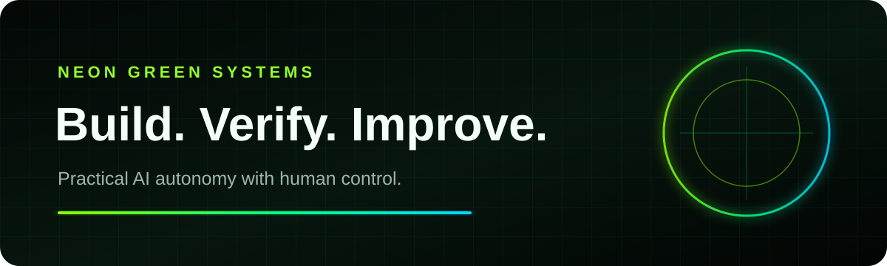

  

# Building practical AI autonomy

I am building systems that help a non-specialist start, understand and safely
improve real projects with AI agents.

## Current focus

1. **Neon Green Harness**: a guided, multi-agent workflow environment for
   Antigravity IDE, VS Code and CLI agents.
2. **Human control**: agents can move quickly, while review, rollback and clear
   evidence remain visible.
3. **Low operating cost**: use the smallest reliable model, tool and process
   that preserves quality, security and speed.
4. **Continuous improvement**: verified experience becomes better rules, tests,
   skills and documentation.

## Project principles

1. Truth before marketing.
2. Private-by-default during pre-production.
3. Multimodal, universal and understandable by a newcomer.
4. Red, Blue, Yellow, Green, Orange, Purple and White perspectives work as one
   system instead of isolated agents.
5. SOTA is a research target, not an unsupported label.

## Join the early community

The product source is still private, but ideas, questions and early-access
interest are welcome in the public community gateway:

[View the Neon Green Harness preview](https://f6z98p6zd7s5.github.io/neon-green-harness/)

[Open Neon Green Harness Community](https://github.com/f6z98p6zd7s5/neon-green-harness-community)

Current phase: **private pre-production**. Public source and production use will
follow only after the security, privacy, documentation and onboarding gates pass.
